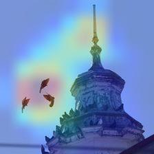

# Bird Classifier

## Summary

In this project, I train a Bird Classifier by using the Deep Learning pretrained model Xception-net, pretrained on the Image-net dataset. I use the dataset of 225 different bird species accessible [here](https://www.kaggle.com/gpiosenka/100-bird-species), however, because the Columbidae-pigeon (the most normal pigeon in Denmark) is not included in the 225 classes I also scraped the internet for pigeon images and included them in the train, validation- and test-sets (See the webscraper-folder for specifics). 

 **Intended Use** The intended use of the best performing model is to keep pigeons of my balcony.

**Key Words:**
* Transferlearning
* Data Scraping
* Deep Learning
* Classifier
* Supervised Learning

## Introduction 

Remember this guy?

Anakin Skywalker of the Star Wars-prequel series. In a rather infamous line, Anakin describes his hate for sand to his soon to be (deceased) wife Padmé. According to Anakin, the main annoying properties of sand is that it is: Coarse, Rough, Irritating, Gets in everywhere.   

And what ensues in the remaining one and a half movie of the prequel series is Anakins' "I-hate-sand-induced-rampage" that leads him to: take out an entire village of sand-people merely for having the word sand in their name, killing of children-jedis, and general taking over of the galaxy.

While I am not totally there, this is close to how I feel about pigeons. Pigeons are, much like sand, irritating  and has the ability to get in everywhere. Moreover they also has the ability to defecate regularly on my balcony and ignore any bird-scaring device that the local handyman store has been able to provide. But rather than take over the galaxy, I decided to build a bird recognizer deep learning system to locate when the pigeons generally visit my balcony, and eventually craft a deep learning fuelded scaring device to keep the effectively off my balcony.

## Dataset, Scraping and Preprocessing

Kaggle, has a dataset of 255 bird-types accessible and free of use [here](https://www.kaggle.com/gpiosenka/100-bird-species), which serves as a good foundation for a bird classifier. The dataset consists of a train-, validation- and test-set. The train-set has ca. 100-150 images of each bird species, while the validation and test has 5 for each.However, while 255 bird-species are quite a few, the main villain: the Columbidae-pigeon is actually missing from the dataset:

To include the columbidae-species, I therefore scraped gettyimages.com for approximately 5.000 images of the columbidae and included 150 in the training-set, and 5 in the validation- and test sets. 

A note on the columbidae species: Because I have scraped the images from the internet, I cannot be certain that the images only include pigeons, which is a stark difference to the rest of the bird-species dataset. For example, I was quite surprised to find Mike Tyson in a rather large amount of the images. 

- The consequence of this, is that the  Columbidae-species could be entangled with alot of other features in an image such as rooftops, streets, humans and of course Mike Tyson.

## Architecture

To create a bird classifier, I will utilize the Deep Learning architecture **Convolutional Neural Network** (CNN).  However, training such models is a time-consuming task if you have to do it from the beginning, so instead I will utilize the model [Xception-Net](https://arxiv.org/pdf/1610.02357.pdf)
pretrained on the [Image-Net](http://www.image-net.org/) dataset.

CNN's has seen a myriad of different alterations of the architecture, such as Inception-Net, ResNet18, ResNet30, ResNet50, VGG16, VGG19 and quite a few other architectures. Most of these models could arguably perform well in this classification task and my choice of Xception-Net was somewhat arbitrary. However, as a baseline I went for a CNN-model, without too many parameters in it. The VGG-series for example has vastly more tunable-parameters and thus would take longer time to train.

As the Xception model is trained on the Image-Net data, I attached 4 layers to the bottom of the network: One GlobalAveragePooling layer and then 3 dense layers with 2048, 1024 and eventually 227 neurons. The two midder dense layers, has a dropout rate of 0.35. For more technical details, see the xception notebook in this github repo.

## Training and Finetuning

The network was initially trained for 40 epochs with Stochastic Gradient Descent (SGD) as optimizer, Categorical Crossentropy as loss function. The weights for the Xception model was set to untrainable, which forces the newly added layers to learn features of the bird-species images first. This achieved an accuracy of 85% on the training-set and 94.82 on the validation-set. 

As a second step, the layers in the Xception base model was set to trainable, and the learning rate of the SGD-optimizer lowered, so the model could be finetuned for the specific task of recognizing birds. The model was trained in this way, for an additional 90 epochs and achieved an accuracy of 93.59 on the validation-set.

# Results

The model ultimately reaches an accuracy of 98.51% on the test-set. Furthermore, the heatmap in the figure underneath shows that the model is well balanced and reliable across most of the bird-species. 

However, as mentioned, the pigeon-species might be entangled with other objects because it is scraped images, unlike the original dataset, which is mainly upclose images of each bird-specie. So to invest how much the pigeon specie also include other objects, I will utilize the [Grad-CAM algorithm](https://keras.io/examples/vision/grad_cam/) to visualize what the last convolutional layer in the model is paying attention to:

Judging from the Grad-Cam images above, the model arguably seems to have identified the pigeons correctly in the images, however it also does seem to be picking up on the spire in the last image. I speculate that this could be remnants from the original Image-Net dataset that the xception model was originally trained on, and going forward I will likely be testing the model on images that has no pigeons in it, and see if this might 

# Conclusion

Utilizing the pretrained model Xception-net, it is possible to make a bird recognizer CNN with an accuracy of 98.51%. 

# Future work

I currently have the model working as a dockerized REST-API, which I plan to making accessible via. a webpage that I am working on (to come in 1-2 weeks), so readers can test the model themselves. 

Additionally, I plan on setting my webcam up so it can take a picture of my balcony every minute and send to the model, and then store the results in a database. 

Once I have an overview of how often pigeons inhabit my balcony, I plan on crafting a scaring-device that will react to them once they land on my balcony. What exactly this scaring-device will look like, I am still alittle unsure of (the current idea is something with cat-noises and perhaps some lights that blink), but I can of course assure the reader that it won't harm any pigeon (or other birds landing on my balcony.)

